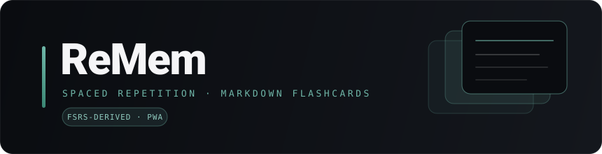

<p align="center">
  
</p>

<h1 align="center">ReMem</h1>

<p align="center"><b>基于 FSRS 改进的间隔重复算法的 Markdown 闪卡学习应用</b></p>
<p align="center">多题型练习 · Anki 风格模板 · 学习统计 · 可安装为 PWA · 单服务器自托管</p>

<p align="center">
  <a href="https://remem.top"></a>
  
  
  
  
  
  <a href="LICENSE"></a>
</p>

<p align="center">
  <a href="#特性">特性</a> ·
  <a href="#快速开始">快速开始</a> ·
  <a href="#技术栈">技术栈</a> ·
  <a href="#项目结构">项目结构</a> ·
  <a href="#赞助">赞助</a> ·
  <a href="#license">License</a>
</p>

<p align="center">
  <a href="https://remem.top"><b>在线体验 Demo</b></a> · 演示账号 <code>demo@remem.app</code> / <code>remem-demo-2026</code>
</p>

---

**ReMem** 是一个让你**真正记住内容**的闪卡学习应用。它以艾宾浩斯遗忘曲线为内核,采用**在 FSRS 基础上改进的间隔重复 / 进度算法**精准调度复习,用 **Markdown** 写卡,支持五种题型与 **Anki 风格的 Field + Template 模板系统**,在桌面与移动端(PWA)都能持续复习、长期坚持。

> 间隔重复调度构建于 [`ts-fsrs`](https://github.com/open-spaced-repetition/ts-fsrs)(FSRS)之上并在其上改进;模板系统借鉴 Anki 的 Note Type 理念,与 Anki 项目无隶属关系。

## 目录

- [特性](#特性)
- [快速开始](#快速开始)
- [技术栈](#技术栈)
- [项目结构](#项目结构)
- [路线图](#路线图)
- [Star 趋势](#star-趋势)
- [赞助](#赞助)
- [License](#license)

## 特性

- **改进的间隔重复算法**：基于 FSRS 改进的调度 + 自研进度模型(0-1 掌握度),比传统 SM-2 更贴合真实记忆曲线;每副牌组可独立配置每日新卡 / 复习上限、目标留存率等参数。
- **Markdown 写卡**：正反面均支持 Markdown,内置代码高亮(highlight.js)、数学公式(KaTeX)、图表(Mermaid),CodeMirror 6 编辑体验。
- **五种题型**：问答 / 选择 / 多选 / 填空 / 判断,同一字段可绑定不同模板。
- **Anki 风格模板**：Field + Card Template 模式,`{{字段名}}` 占位符替换,JSON 与 Markdown 序列化往返无损;支持批量导入。
- **学习统计**：复习热力图 + 记忆留存曲线,首页与独立 `/stats` 页双视图。
- **PWA + 移动适配**:可"添加到主屏幕"全屏启动,移动端玻璃拟态底部导航,响应式布局,离线壳缓存。
- **多用户 + 自托管**:NextAuth v5 凭据登录,数据按用户隔离;单台 Node.js + SQLite 即可部署,数据完全在你自己手里。
- **统一设计系统**:冷淡风沙绿主题,声明式 UI + 毛玻璃 + 设计 token,亮 / 暗色双主题,WCAG AA 对比度。

## 快速开始

> 需要 **Node.js >= 20** 与 **pnpm 10**。

```bash
# 1. 安装依赖
pnpm install

# 2. 准备环境变量
cp .env.example .env.local
# 生成一个 NEXTAUTH_SECRET 并填入 .env.local：
node -e "console.log(require('crypto').randomBytes(32).toString('base64'))"

# 3. 初始化数据库（SQLite）
pnpm prisma migrate dev

# 4.（可选）创建一个测试用户，密码会随机生成并打印到终端
node scripts/create-admin.mjs

# 5. 启动开发服务器
pnpm dev
```

访问 <http://localhost:3000>,注册账户后即可开始。

**生产构建**

```bash
pnpm build && pnpm start   # 单服务器 Node.js + SQLite
```

提交前请确保三道门全部通过:`pnpm typecheck && pnpm lint && pnpm build`。

## 技术栈

| 层 | 选型 |
|---|---|
| 框架 | Next.js 15(App Router · RSC · Server Actions)+ React 19 + TypeScript 5.7 |
| 样式 | Tailwind CSS 3.4 + shadcn/ui(new-york)+ 毛玻璃设计 token |
| 数据 | Prisma 6 + SQLite |
| 认证 | NextAuth v5 + bcryptjs |
| 算法 | ts-fsrs(FSRS,在其上改进)+ 自研进度模型 |
| 内容 | CodeMirror 6 · react-markdown · KaTeX · Mermaid · highlight.js |
| 图表 | Recharts |
| 状态 | Zustand · Zod |

> 依赖全部**精确锁版本**(无 `^`/`~`/`latest`),供应链零信任。

## 项目结构

```
src/
├── app/          # Next.js App Router 页面、Server Actions 与 API 路由
├── components/   # React 组件（UI / 布局 / 统计图表 / PWA）
├── lib/          # 工具与核心算法
│   └── fsrs/     # 间隔重复调度、进度模型、队列、graduation（纯函数）
├── stores/       # Zustand 状态
├── hooks/        # 自定义 hooks
└── types/        # TypeScript 类型
prisma/           # 数据库 schema 与迁移
public/           # 静态资源、PWA manifest 与 service worker
docs/             # 设计系统等文档
```

## 路线图

- [x] FSRS 改进调度 + 自研进度模型
- [x] 五题型 + Anki 风格 Field/Template 模板系统 + 批量导入
- [x] 学习统计(热力图 / 留存曲线)
- [x] PWA + 移动端底部导航 + UI 视觉重构
- [ ] 桌面端(Electron,Windows / Linux / macOS)离线单机版
- [ ] Android(Capacitor)离线单机版
- [ ] 多设备云同步(规划中)

> 桌面 / 移动端原生版为**移除账户的本地优先**形态,正在独立分支探索,不影响本仓库的 Web 版本。

## Star 趋势

如果这个项目对你有帮助,欢迎点一个 Star。

<a href="https://star-history.com/#KRPCT/ReMem&Date">
  
</a>

## 赞助

ReMem 由个人利用业余时间开发与维护,**免费、无订阅、无广告**。如果它帮你省下了一份记忆软件订阅,或你希望桌面 / 移动端离线版能继续做下去,欢迎请作者喝杯咖啡,完全自愿,与你的数据和功能访问无关。

<table>
  <tr>
    <td align="center" width="320">
      <br>
      <b>微信支付</b>
    </td>
    <td align="center" width="320">
      <br>
      <b>支付宝</b>
    </td>
  </tr>
</table>

不方便赞助?**点个 Star、提个有质量的 issue,或把它分享给需要的人**,对项目同样是实打实的帮助。

## License

本项目采用 **[PolyForm Noncommercial License 1.0.0](LICENSE)**。

允许个人 / 研究 / 教学 / 非营利组织的使用、修改与再分发;**禁止任何商业用途**。详见 [`LICENSE`](LICENSE)。

---

<p align="center"><sub>Copyright (c) 2026 KRPCT · 让你真正记住,而不只是读过。</sub></p>
