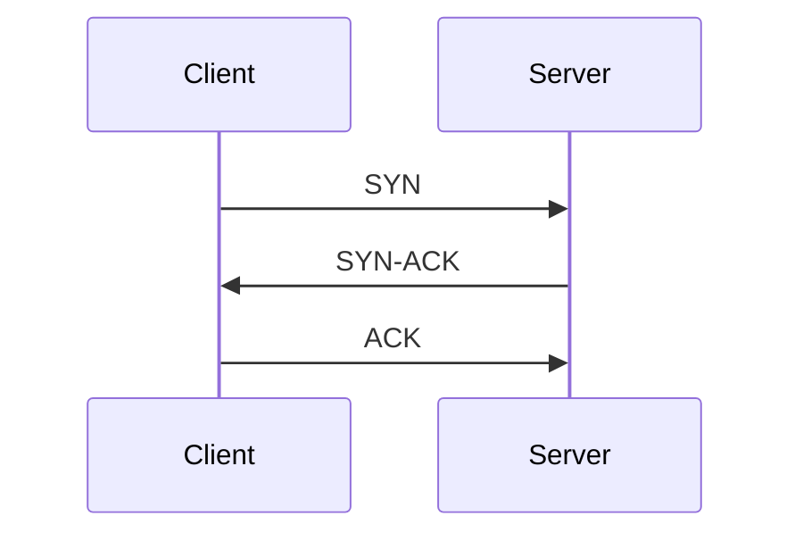
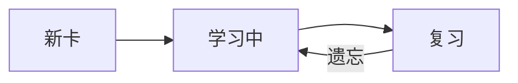

光速在真空中约是多少？
---
约 **299,792,458 米/秒**（约 30 万 km/s）。

===

HTTP 状态码 `404` 表示什么？
---
请求的资源未找到（Not Found）。

===

中国四大名著是哪四部？
---
《红楼梦》《西游记》《水浒传》《三国演义》。

===

什么是闭包 (closure)？
---
函数与其词法作用域的组合，使其能访问定义时所在的外部变量。

===

二分查找的平均时间复杂度是多少？
---
`O(log n)`。

===

TCP 与 UDP 最核心的区别是什么？
---
TCP 面向连接、可靠、有序；UDP 无连接、开销小，但不保证可靠与顺序。

===

勾股定理的内容是什么？
---
直角三角形两直角边的平方和等于斜边的平方：a² + b² = c²。

===

`git rebase` 的作用是什么？
---
把一段提交重放到新的基底上，得到线性的提交历史（会改写历史）。

===

牛顿第二定律的公式是什么？
---
F = ma（合外力 = 质量 × 加速度）。

===

CSS 中 `flex: 1` 是什么含义？
---
等价于 `flex: 1 1 0%`，元素按比例占据容器的剩余空间。

===

下列哪个是质数？
A. 2
B. 4
C. 6
D. 8
答案: A
---
2 是最小的质数。

===

HTML 中表示最高级标题的标签是？
A. h6
B. h1
C. title
D. head
答案: B

===

太阳系中体积最大的行星是？
A. 地球
B. 火星
C. 木星
D. 金星
答案: C

===

下列主要用于描述样式的语言是？
A. Python
B. Java
C. C++
D. CSS
答案: D

===

1 字节 (byte) 等于多少位 (bit)？
A. 8
B. 4
C. 16
D. 32
答案: A

===

下列哪个是分布式版本控制工具？
A. Docker
B. Git
C. Nginx
D. Redis
答案: B

===

圆周率 π 约等于？
A. 2.71
B. 1.41
C. 3.14
D. 1.61
答案: C

===

下列哪种动物是哺乳动物？
A. 鲸鱼
B. 鲨鱼
C. 金鱼
答案: A

===

下列哪个不是 JavaScript 的原始类型 (primitive)？
A. string
B. array
C. number
D. boolean
E. symbol
答案: B

===

HTTPS 默认使用的端口号是？
A. 21
B. 25
C. 80
D. 443
答案: D

===

下列哪个是文档型 NoSQL 数据库？
A. MySQL
B. PostgreSQL
C. MongoDB
D. SQLite
答案: C

===

下列排序算法中，平均时间复杂度为 O(n log n) 的是？
A. 快速排序
B. 冒泡排序
C. 插入排序
D. 选择排序
答案: A

===

下列哪些是编程语言？
A. Python
B. HTML
C. Java
D. CSS
答案: A、C
---
HTML 与 CSS 是标记/样式语言，不是编程语言。

===

下列哪些数是质数？
A. 2
B. 3
C. 4
D. 5
E. 6
答案: A、B、D

===

下列哪些属于 HTTP 请求方法？
A. GET
B. POST
C. FETCH
D. DELETE
答案: A、B、D

===

下列哪些是前端框架或库？
A. React
B. Vue
C. Django
D. Svelte
E. Flask
答案: A、B、D

===

下列哪些是惰性气体？
A. 氦
B. 氮
C. 氖
D. 氩
答案: A、C、D

===

下列哪些是传统意义上的中国一线城市？
A. 北京
B. 上海
C. 广州
D. 深圳
E. 成都
答案: A、B、C、D

===

下列哪些可用于前端状态管理？
A. Redux
B. Webpack
C. Zustand
D. MobX
答案: A、C、D

===

下列哪些是 TCP/IP 四层模型中的层？
A. 应用层
B. 传输层
C. 会话层
D. 网络层
答案: A、B、D

===

下列哪些是版本控制系统？
A. Git
B. SVN
C. Maven
D. Mercurial
答案: A、B、D

===

下列哪些是合法的 CSS 长度/尺寸单位？
A. px
B. rem
C. kg
D. vh
E. sec
答案: A、B、D

===

水的化学式是 {{c1::H₂O}}。

===

中国的首都是 {{c1::北京}}。

===

{{c1::牛顿}} 第一定律又称为 {{c2::惯性}}定律。

===

光的三原色 (RGB) 是 {{c1::红}}、{{c2::绿}}、{{c3::蓝}}。

===

勾股定理：a² + b² = {{c1::c²}}。

===

HTTP 的默认端口是 {{c1::80}}，HTTPS 的默认端口是 {{c2::443}}。
---
端口用于区分明文与加密流量。

===

光合作用在 {{c1::叶绿体}} 中进行，{{c1::叶绿体}} 含有叶绿素。

===

二进制中 1 + 1 = {{c1::10}}，十进制中 1 + 1 = {{c2::2}}。

===

JavaScript 中声明块级常量使用关键字 {{c1::const}}。

===

太阳系八大行星里，离太阳最近的是 {{c1::水星}}，最远的是 {{c2::海王星}}。

===

圆的面积公式为 S = {{c1::πr²}}。

===

存储单位换算：1 KB = {{c1::1024}} B，1 MB = {{c2::1024}} KB，1 GB = {{c3::1024}} MB。

===

鲸鱼是鱼类。
答案: 错误
---
鲸鱼是哺乳动物，用肺呼吸、胎生哺乳。

===

水在标准大气压下 100°C 沸腾。
答案: 正确

===

地球绕着太阳公转。
答案：对

===

太阳从西边升起。
答案: 错
---
太阳东升西落。

===

HTTP 是一种无状态协议。
---
答案: true

===

Python 是一门编译型语言。
---
Python 是解释型语言。
答案: false

===

0 是偶数。
答案: 正确

===

所有质数都是奇数。
答案: 错误
---
2 是唯一的偶质数。

===

光速是宇宙中信息传播速度的上限。
---
答案: 对

===

TCP 是不可靠的传输协议。
答案: 错
---
TCP 提供可靠、有序的字节流传输。

===

质能等价公式是什么？（行内 KaTeX）
---
$E = mc^2$，其中 $m$ 是质量，$c$ 是真空中的光速。

===

一元二次方程 $ax^2 + bx + c = 0$ 的求根公式是？（块级 KaTeX）
---
$$x = \frac{-b \pm \sqrt{b^2 - 4ac}}{2a}$$

===

高斯积分 $\int_{-\infty}^{\infty} e^{-x^2}\,dx$ 的值是多少？
---
$$\int_{-\infty}^{\infty} e^{-x^2}\,dx = \sqrt{\pi}$$

===

用 JavaScript 写一个反转字符串的函数。（代码高亮）
---
```js
const reverse = (s) => [...s].reverse().join("");
console.log(reverse("hello")); // "olleh"
```

===

用 Python 实现斐波那契数列前 n 项。（代码高亮）
---
```python
def fib(n):
    a, b = 0, 1
    seq = []
    for _ in range(n):
        seq.append(a)
        a, b = b, a + b
    return seq
```

===

画出 TCP 三次握手的时序图。（Mermaid）
---


===

画出卡片学习状态的流转图。（Mermaid）
---


===
氧的元素符号是 {{c1::O}}，水分子 H₂{{#1}} 中也含有它（{{#1}} 复用第 1 空的答案 O）。
===
下列关于质数的说法，哪一项正确？
A. 2 是质数
B. 9 是质数
C. 1 是质数
D. 以上都不对
答案: A
置底: 是
===
下列各数已按从小到大排列，其中最小的是？
A. 2
B. 3
C. 5
D. 7
答案: A
乱序: 否
